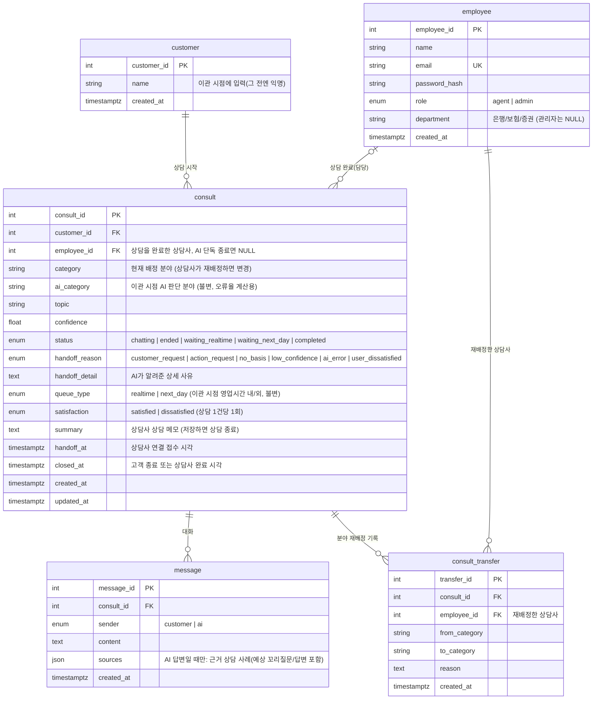

# 웹 DB 스키마 (공용 DB의 웹 전용 테이블)

공용 DB(`.env` 의 `DB_*`) 안에 RAG 지식베이스 `financial_consulting_qa` 와 **같이** 있다. 아래 5개가 웹(Flask) 전용 테이블이고,
`web/app/models/` 의 SQLAlchemy 모델과 1:1 이다. 구조를 바꿨다면 `cd web && flask --app app reset-db --yes` 로 웹 테이블만 다시 만든다
(`db.create_all()` 은 이미 있는 테이블의 컬럼 변경을 반영하지 않는다). 지식베이스는 모델에 없어서 건드리지 않는다.

## ERD



## 상담 상태 흐름

```
chatting(AI 상담 중) ─ 고객이 [상담 종료] ─▶ ended
        │
        └ 고객이 [상담사 연결] + 이름 입력 ─▶ waiting_realtime(영업시간 내) / waiting_next_day(영업시간 외)
                                                  └ 상담사가 상담 메모 저장 ─▶ completed
```

- 상담사는 **자기 `department` 와 같은 `category`** 의 대기 건과 `category` 가 NULL 인 **미분류 건**을 본다 (미분류는 모든 상담사 큐에 "미분류" 태그로 보인다).
- 상담사는 고객과 대화하지 않는다. 마지막 단계는 상담 메모(`summary`) 저장이며, 저장하면 `completed` 가 된다. 완료한 건은 상담사 화면의 "내 완료" 탭에서 읽기 전용으로 볼 수 있다.
- **미분류 건을 종료하면** 처리한 상담사의 `department` 가 `category` 로 배정된다. `ai_category` 는 NULL 로 남아 오분류로 세지 않는다.
- **분야 이관(재배정)**: 상담사가 대기 건의 `category` 를 다른 분야로 바꾸면 해당 분야 큐로 넘어가고 `consult_transfer` 에 한 줄이 쌓인다. 미분류 건을 직접 배정하면 `from_category` 는 "미분류" 로 기록된다.
- **AI 단독 해결** = `status = ended` 이고 `satisfaction` 이 불만족이 아닌 건.
- **AI 분류 오류율** (관리자 대시보드, `services/classification_stats.py`)
  - 대상: `handoff_at` 이 있고 `ai_category` 가 은행/보험/증권인 상담
  - 오분류: 그중 `consult_transfer.from_category = ai_category` 인 이관이 1건 이상 있는 상담 (여러 번 이관해도 1건)
  - 오류율 = 오분류 / 대상. 분야별(`ai_category` 기준)과 전체를 보여주고, `ai_category` 가 NULL 인 건은 "AI 미분류"로 따로 센다.

## 이전(로컬 개발 단계) 구조에서 바뀐 점

| 테이블 | 변경 |
|---|---|
| `consult` | **추가** `ai_category`, `handoff_detail`, `handoff_at`, `closed_at` · **변경** `status` 값(`ai_resolved`·`in_progress` 제거, `chatting`·`ended` 추가), `handoff_reason` 값(`ai_low_confidence` 제거, 5종 세분화), `summary` 는 상담사 메모로 용도 확정 |
| `message` | **추가** `sources`(JSON) · **변경** `sender` 에서 `agent` 제거 |
| `consult_transfer` | **신규** |
| `customer`, `employee` | 변경 없음 (`employee.department` 는 상담사에게 필수) |
